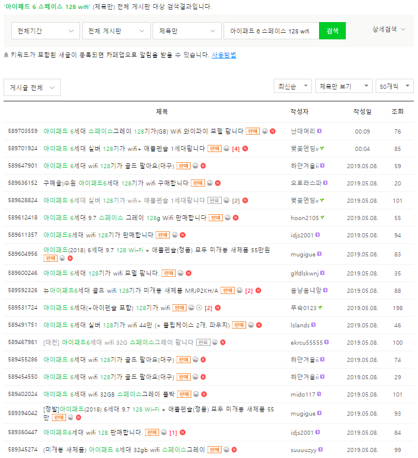

# 중고거래
평화로운 중고나라에 대한 여러 이야기들을 많이 들어서  
중고로 무언가를 구매하는 데에 두려움이 있었음  

상품으로 컴퓨터 부품 등을 받아서 중고거래 사이트에서 미개봉 신품으로 거래하는 사람을 본 적이 있음  
중고거래에 대한 불신이 많이 줄어드는 계기가 되었음

중고책을 구매해 보니 생각보다 나쁘지 않았고  
중고 사이트에서 미개봉 신품 구매해서 잘 사용하는 사람도 본 적이 있어서    
아이패드를 중고로 구매해 볼까도 생각했었음  
 
구매하고자 하는 제품(아이패드 6세대 스페이스그레이 128Gb Wifi)의 중고 시장가격을 알아보고 싶었으나  
중고나라에서만 찾아봤을 때도 판매한다는 글이 너무 많았고(저렇게나 취향이 확고 했는데도 많은 글이 있어서 놀랐었음) 
 

 
가격이 천차만별이었음  
어느 정도가 적당한 가격인지 알 수가 없었고 
안목이나 협상능력이 그리 뛰어나지 않다는 걸 잘 알고 있어서  
결국 새 제품을 구매했었음

구매하고자 하는 제품의 중고 시장가격을 알았더라면   
제품의 상태와 가격을 고려하여 적절한 가격에 대한 기준을 가질 수 있었을 것 같음  

또, 현재 사용하고 있는 모델에 만족하고 있으나  
아이패드 미니5가 새로 출시되어서 중고로 팔고 새 제품을 구매 하고 싶은 마음도 있음  
중고제품을 올렸을 때 빨리 판매되면서도 만족할 만한 액수를 받는데  
중고 시장가격, 조회수가 많거나 빨리 판매되는 글들에 대해 알면 도움을 받을 수 있을 것임  

지극히 개인적인 이유로 아이패드 중고 거래 시세에 대해 알아보고자 함
