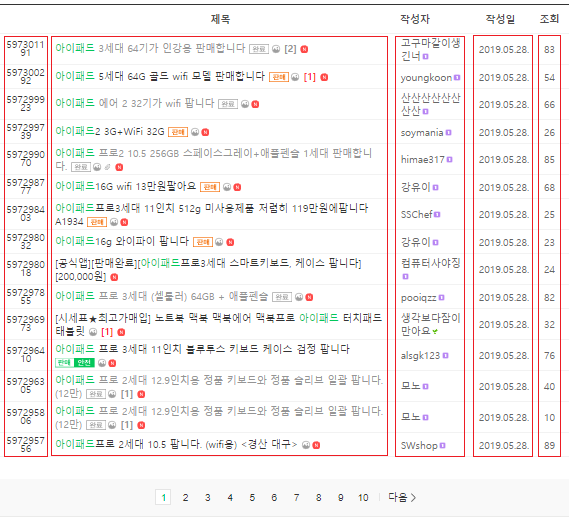

# 아이패드 중고거래 시세
### 1. 해결하고자 하는 문제
아이패드를 중고로 구매하고자 했으나 판매글이 많고 적당한 가격을 결정할 수 없어서 결국 새 제품을 구매한 경험이 있다.  
구매하고자 하는 제품(아이패드 6세대 스페이스그레이 128Gb Wifi)을 중고나라에서만 찾아봤는 데도 판매한다는 글이 많았다.
꽤나 구체적인 취향이었는데도 많은 판매자가 있어서 놀랐었다.
  

  
게다가 글마다 판매 가격이 천차만별이어서 중고제품들을 비교하는 데에 어려움이 있었다.  
 
구매하고자 하는 제품의 중고 시세를 알면 구매 의사 결정시 도움을 받을 수 있을 것이다.
   
### 2. 데이터 수집
중고나라에서 아이패드에 대한 글을 크롤링 해왔다.  
 

 
검색결과 목록에서 <strong>판매글 url, 작성자 닉네임, 제목, 조회수, 작성일, 조회수</strong>를 긁어왔다.
  

 
검색결과 목록에서 얻은 url을 이용하여 판매글에 접근한 후 <strong>판매 여부, 가격, 작성자 아이디</strong>를 긁어왔다.
  

 
수집한 데이터를 저장한 내용은 <a href="https://github.com/kim3412/Crawling/tree/master/result">result</a> 참조   
  
데이터를 수집을 위한 시행착오 과정은 <a href="https://github.com/kim3412/Crawling/blob/master/makeCode.md">makeCode.md</a> 참조   
코드는 <a href="https://github.com/kim3412/Crawling/blob/master/crawling.R">crawling.R</a> 참조  
  
※ 게시글의 본문 내용을 긁어오긴 했으나 필요없는 반복되는 부분을 제거해야 하고 몇몇 글은 여러 행을 잡아먹음. 일단 txt로 저장  
   
