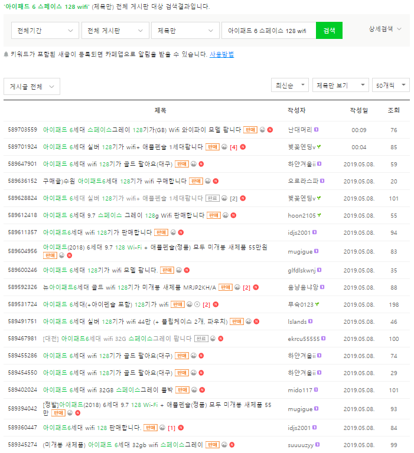

# 아이패드 중고거래 시세
### 1. 해결하고자 하는 문제
아이패드를 중고로 구매하고자 했으나 판매글이 많고 적당한 가격을 결정할 수 없어서 결국 새 제품을 구매한 경험이 있다.  
구매하고자 하는 제품(아이패드 6세대 스페이스그레이 128Gb Wifi)을 중고나라에서만 찾아봤는 데도 판매한다는 글이 많았다.
꽤나 구체적인 취향이었는데도 많은 판매자가 있어서 놀랐었다.
  

  
게다가 글마다 판매 가격이 천차만별이어서 중고제품들을 비교하는 데에 어려움이 있었다.  
 
구매하고자 하는 제품의 중고 시세를 알면 구매 의사 결정시 도움을 받을 수 있을 것이다.
   
### 2. 데이터 수집
중고나라에서 아이패드에 대한 글을 크롤링 해왔다.  
 

 
검색결과 목록에서 <strong>판매글 url, 작성자 닉네임, 제목, 조회수, 작성일, 조회수</strong>를 긁어왔다.
  

 
검색결과 목록에서 얻은 url을 이용하여 판매글에 접근한 후 <strong>판매 여부, 가격, 작성자 아이디</strong>를 긁어왔다.
  

 
수집한 데이터를 저장한 내용은 <a href="https://github.com/kim3412/Crawling/tree/master/result">result</a> 참조   
  
데이터를 수집을 위한 시행착오 과정은 <a href="https://github.com/kim3412/Crawling/blob/master/makeCode.md">makeCode.md</a> 참조   
코드는 <a href="https://github.com/kim3412/Crawling/blob/master/crawling.R">crawling.R</a> 참조  
  
※ 게시글의 본문 내용을 긁어오긴 했으나 게시글의 양식에 해당하는 부분을 제거해야 함. 또, 몇몇 글은 여러 행을 잡아먹어서 일단 txt로 저장  
   
### 3. 데이터 전처리
- "제목"으로만 검색하는 url을 얻지 못해서 "제목+내용"으로 검색하는 url을 통해 데이터를 긁어왔기 때문에 제목에 아이패드를 포함하지 않는 게시글들을 제거 
- 아이패드 악세사리 <strong>단품(케이스, 키보드, 필름, 충전기 등)</strong> 거래 게시글 제거  
- 다른 기종과의 <strong>교환</strong>을 원하는 게시글 제거  
- <strong>사기</strong>임을 알려주는 게시글 제거("Bonory", "o카톡사기주의요망", "조선족카톡사기링크" 등의 작성자가 사기 게시글에 대한 정보를 올림)  
- 기종별, 구성별로 분류하여 데이터셋 따로 구성하기  
- 개봉여부나 리퍼기간, 애플케어 여부 등을 파악하기(제목에서 파악가능할 때도 있고 본문을 봐야할 때도 있음)  
~~정규표현식 공부해야겠다. 코드가 길어진다.~~
   
### 4. EDA

 
- 이상점 찾기: 실제 거래 가격보다 싼 가격을 의도적으로 게시글에 적어 놓는 경우가 있음.  
- 가격에 영향을 미칠만한 요소 찾아보기: 개봉여부, 리퍼기간, 애플케어여부, 작성날짜 등과 가격의 관계 그래프로 그려보기  
- 새 제품 출시로 인한 변화 찾아보기: 새 제품 출시 후 바로 이전에 출시되었던 모델들의 가격, 거래량 등의 변화 살펴보기   
   
### 5. 가격에 영향을 끼치는 요인 조사하기
최종적으로 가격에 영향을 미치는 요인들과 회귀식을 구해보는 것이 목표이다.
