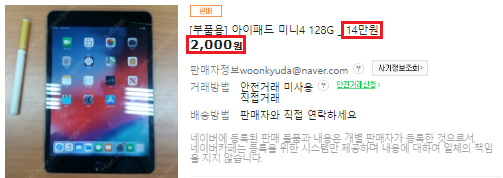

# 아이패드 중고거래 시세
### 1. 해결하고자 하는 문제
아이패드를 중고로 구매하고자 했으나 판매글이 많고 적당한 가격을 결정할 수 없어서 결국 새 제품을 구매한 경험이 있다.  
구매하고자 하는 제품(아이패드 6세대 스페이스그레이 128Gb Wifi)을 중고나라에서만 찾아봤는 데도 판매한다는 글이 많았다.
꽤나 구체적인 취향이었는데도 많은 판매자가 있어서 놀랐었다.
  

  
게다가 글마다 판매 가격이 천차만별이어서 중고제품들을 비교하는 데에 어려움이 있었다.  
 
구매하고자 하는 제품의 중고 시세를 알면 구매 의사 결정시 도움을 받을 수 있을 것이다.
   
### 2. 데이터 수집
중고나라에서 아이패드에 대한 게시글을 크롤링 해왔다.  
 

 
검색결과 목록에서 <strong>판매글 url, 작성자 닉네임, 제목, 조회수, 작성일, 조회수</strong>를 긁어왔다.
   

 
검색결과 목록에서 얻은 url을 이용하여 판매글에 접근한 후 <strong>판매 여부, 가격, 작성자 아이디</strong>를 긁어왔다.
   

 
수집한 데이터를 저장한 내용은 <a href="https://github.com/kim3412/Crawling/tree/master/result">result</a> 참조   
  
데이터를 수집을 위한 시행착오 과정은 <a href="https://github.com/kim3412/Crawling/blob/master/makeCode.md">makeCode.md</a> 참조   
코드는 <a href="https://github.com/kim3412/Crawling/blob/master/crawling.R">crawling.R</a> 참조  
  
※ 게시글의 본문 내용을 긁어오긴 했으나 게시글의 양식에 해당하는 부분을 제거해야 함. 또, 몇몇 글은 여러 행을 잡아먹어서 일단 txt로 저장  
※ 게시글에 달린 <strong>댓글</strong>을 긁어오는 코드 추가  
   
### 3. 데이터 전처리
<strong>data cleaning</strong>  
- "제목"으로만 검색하는 url을 얻지 못해서 "제목+내용"으로 검색하는 url을 통해 데이터를 긁어왔기 때문에 제목에 아이패드를 포함하지 않는 게시글들을 제외 
- 아이패드 악세사리 <strong>단품(케이스, 키보드, 필름, 충전기 등)</strong> 거래 게시글 제외  
- 다른 기종과의 <strong>교환</strong>을 원하는 게시글 제외  
- <strong>사기</strong>임을 알려주는 게시글 제외("Bonory", "o카톡사기주의요망", "조선족카톡사기링크" 등의 작성자가 사기 게시글에 대한 정보를 올림)  

<strong>기종별로 분류하여 데이터셋 따로 구성하기</strong>  
현재 프로 1세대, 2세대, 3세대에 대한 분류 구현하였음  
 
디스플레이 크기, 연결방식, 용량, 색상, 서비스, 상태, 펜슬, 키보드에 대한 정보를 추출하였음  
- 디스플레이 크기: <strong>숫자</strong>, 여러 기기를 팔고 있는 경우에는 에러로 표시(가격정보가 어느 크기의 기기에 해당하는지 알 수 없음)  
- 연결방식: <strong>(cellular, wifi)</strong>  
- 용량: <strong>숫자</strong>, 디스플레이 크기와 마찬가지 이유로 여러 기기를 팔고 있는 경우 에러로 표시  
- 색상: <strong>문자열</strong>, 색상은 가격에 영향을 미치지 않는다고 생각해서 여러 색상을 판매하고 있어도 모두 표시 하였음  
- 서비스: <strong>(리퍼, 에플케어플러스)</strong>, A/S 비용이 많이 드는 애플 제품의 특성을 고려하여 리퍼기간이 남아 있는지, 애플케어플러스에 가입했는지를 파악함(리퍼기간이 언제까지인지 구체적으로 올리는 경우가 많았으나 정규표현식이 익숙치 않아 캡쳐하지 못했음.)    
- 상태: <strong>(풀박스, 리퍼제품, 미개봉, 새상품)</strong>, 고장에 대한 분류도 필요하나 정규표현식이 익숙치 않아 캡쳐하지 못했음.  
- 펜슬: <strong>(0, 1)</strong>, 펜슬을 포함하지 않으면 0, 포함하면 1, 펜슬도 10만원 상당의 고가이므로 가격에 영향을 미친다고 생각했음.  
- 키보드: <strong>(0, 1)</strong>, 키보드를 포함하지 않으면 0, 포함하면 1, 키보드도 10만원 상당의 고가이므로 가격에 영향을 미친다고 생각했음.  
  
(개봉여부나 리퍼기간, 애플케어 여부 등은 제목에서 파악가능할 때도 있고 본문을 봐야할 때도 있음) 
   

### 4. 수집한 데이터
2019년 5월 20일 부터 6월 11일까지 <strong>총 19일</strong> 동안 데이터를 수집하였다.  
(5월 22일, 27일, 29일, 6월 3일은 데이터가 누락되었다.)  
 
전처리 하기 전에 하루에 약 900개의 게시글이 올라왔고  
단품, 교환, 매입 글 등을 제외하니 <strong>일평균 700개</strong>의 게시글이 올라왔다.  
 
분류 과정을 수행한 프로 모델의 경우, 평균적으로   
프로 1세대: 97건  
프로 2세대: 77건  
프로 3세대: 115건  
의 글이 올라왔다.
   
### 5. EDA

 
- 이상점 찾기: 의도적으로 실제 거래 가격보다 싸게 게시하는 경우가 있음.  
- 가격에 영향을 미칠만한 요소 찾아보기: 개봉여부, 리퍼기간, 애플케어여부, 작성날짜 등과 가격의 관계 그래프로 그려보기  
- 새 제품 출시로 인한 변화 찾아보기: 새 제품 출시 후 바로 이전에 출시되었던 모델들의 가격, 거래량 등의 변화 살펴보기  
(2019년 4월 23일 미니5가 한국에 정식 출시 되었음. 이미 많은 게시글들이 사라지고 없었음. 새제품이 언제 출시될지 모르므로 게시글들이 더 사라지기 전에 긁어 놓아야 함.)
   
### 6. 가격에 영향을 끼치는 요인 조사하기
최종적으로 가격에 영향을 미치는 요인들과 회귀식을 구해보는 것이 목표이다.
