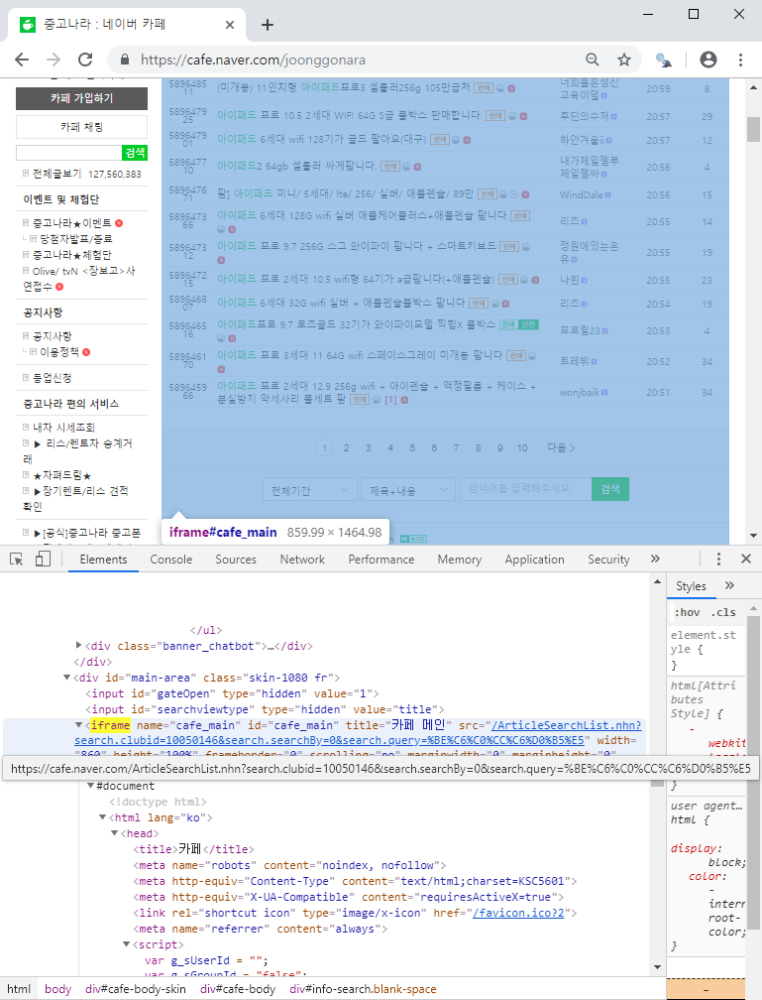
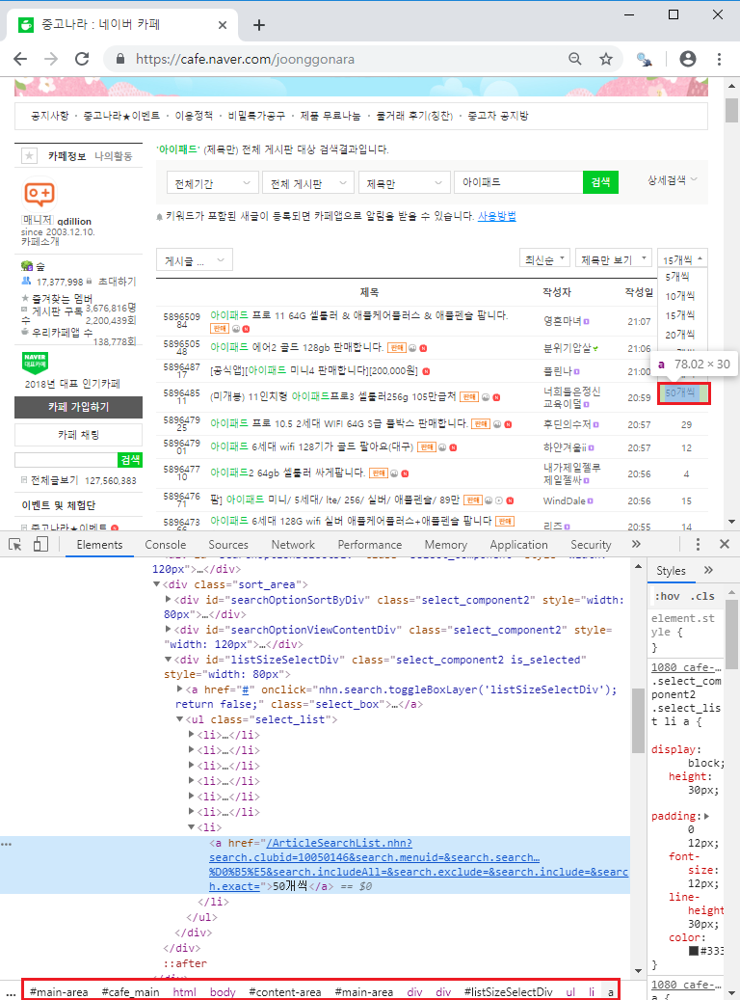
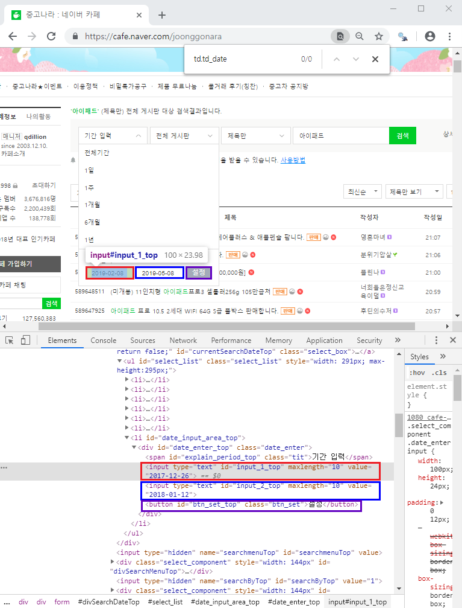
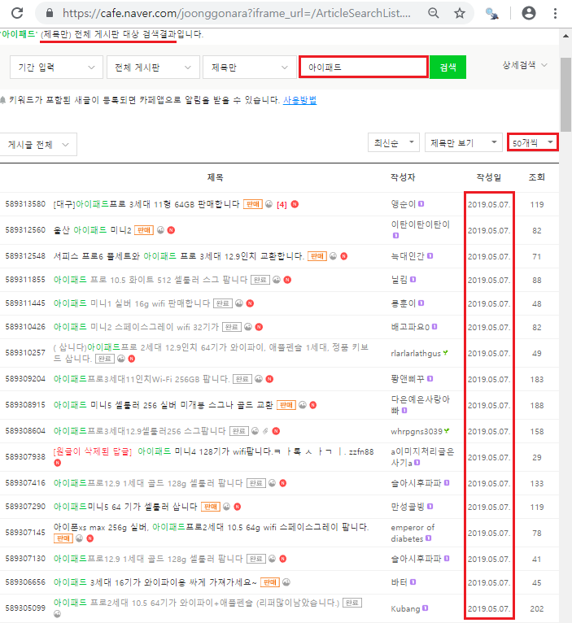
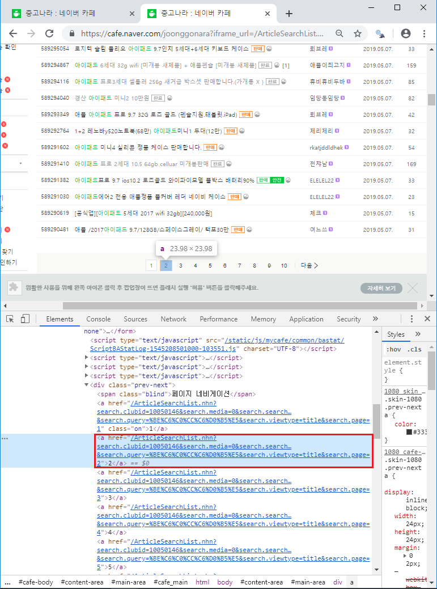
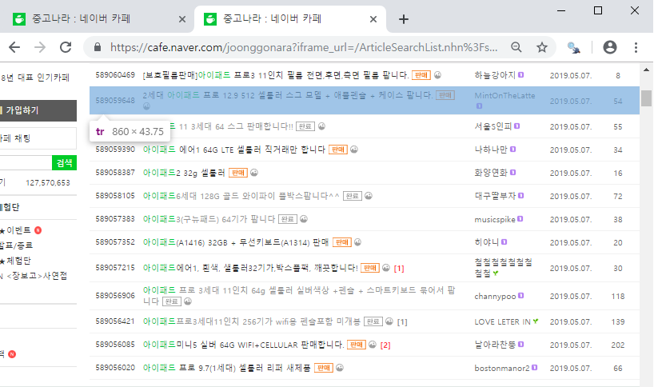
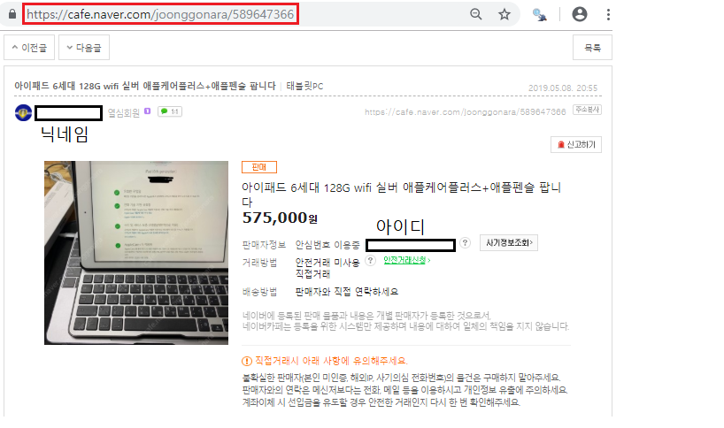

# 코드 작성 과정

### 1. 아이패드 검색
중고나라 첫 화면<br>

<br>빨간색 상자에 '아이패드'를 검색
```r
# 중고나라 첫 화면으로 이동
remDr$navigate("https://cafe.naver.com/joonggonara")
# 빨간색 상자 찾기, id를 이용하여 찾음
queryInput = remDr$findElement(using="id", value="topLayerQueryInput")
# "아이패드"라고 입력하면 '?븘?씠?뙣?뱶'를 검색
# "아이패드"를 utf-8로 변환한 값을 이용하여 검색
queryInput$sendKeysToElement(list("\xEC\x95\x84\xEC\x9D\xB4\xED\x8C\xA8\xEB\x93\x9C", key="enter"))
```

### 2. frame 전환
위 상태에서 페이지 소스를 받으면 아이패드 검색결과가 빠져 있음
(상단의 내용과 좌측의 내용만 보임)


<br><br>
naver cafe의 경우 iframe을 통해 구성되어 있음

Selenium은 최상위의 문서만을 인식할 수 있음.  
iframe에 있는 element를 이용하려면 창을 변경하는 것과 유사하게 frame을 변경해야 함.

#### iframe(Inline Frame)
웹 페이지 안에 또 다른 웹 페이지 삽입  
문서내의 원하는 위치에 삽입 가능

```r
remDr$switchToFrame("cafe_main")
```

### 3. 한 페이지에 가능한 많은 결과 보기

```r
listSize50 = remDr$findElement(using="css", value="#listSizeSelectDiv > ul > li:nth-child(7) > a")
remDr$navigate(listSize50$getElementAttribute("href"))
remDr$switchToFrame("cafe_main")
```
프레임을 변경하지 않으면 위에서와 같이 상단과 좌측의 내용만 보임  
프레임을 변경하면 다시 15개의 아이템만 보임  
  
해결방법을 찾지 못해서 15개씩 얻어오기로 함  

### 4. 특정 날짜에 게시된 글만 보기
이전 스크립트에서 긁어온 정보를 중복하여 긁어오지 않도록 하는 것이 목표

처음에는 게시글의 번호를 이용하려 함  
이전 스크립트에서 긁어온 글 중에 가장 나중에 쓰인 글의 게시글 번호를 얻고  
긁어오는 시점에서 가장 최근 글부터 긁어가며 위에서 얻은 게시글 번호와 동일하면 크롤링을 멈추는 알고리즘을 생각했음  

하지만 글이 실시간으로 올라와 1페이지에서 크롤링을 하고 2페이지로 넘어 갔을 때  
1페이지의 글이 2페이지로 밀려나 글이 중복되는 경우가 발생했음   

위와 같은 중복을 피하기 위해서 더 이상 게시글이 생성되지 않을 때 크롤링 하기로 함  

기간을 설정하는 란을 발견  
지나간 날의 게시글만 보면 크롤링 하는 도중에 게시글의 수가 변화하지는 않음  

또한, 같은 날 쓰여진 게시글만 크롤링하면 긁어온 데이터인지 판단할 필요가 없음  

데이터가 최대한 최신일 때 긁어오기 위해서  
자정이 조금 지났을 때 어제 올라온 게시글을 크롤링 해오는 방식으로 코딩하려 함.
<br>


```r
sDate = remDr$findElement(using="id", value="input_1_top")
sDate$setElementAttribute("value", "20190507")
eDate = remDr$findElement(using="id", value="input_2_top")
eDate$setElementAttribute("value", "20190507")
setBtn = remDr$findElement(using="id", value="btn_set_top")
setBtn$clickElement()
queryInput = remDr$findElement(using="id", value="queryTop")
# 위와 마찬가지로 "아이패드"의 utf-8값을 입력
queryInput$sendKeysToElement(list("\xEC\x95\x84\xEC\x9D\xB4\xED\x8C\xA8\xEB\x93\x9C", key="enter"))
```
위 코드를 실행하고 pageUrl을 얻으면 아래와 같음   
https://cafe.naver.com/ArticleSearchList.nhn?search.clubid=10050146  
&search.searchdate=2019-02-082019-05-08
&search.searchBy=1&search.query=%BE%C6%C0%CC%C6%D0%B5%E5%  
BE%C6%C0%CC%C6%D0%B5%E5  
&search.defaultValue=1&search.includeAll=&search.exclude=&search.include=&search.exact=&search.sortBy=date
&userDisplay=15  
&search.media=0&search.option=0  
  
기간이 입력되지 않았고, '아이패드아이패드'를 검색함  

url을 살펴보면 searchdate, query, userDisplay 을 이용하여 원하는 결과를 얻을 수 있을 것임을 추측할 수 있음  
searchdate를 2019-05-072019-05-07 로  
query를 %BE%C6%C0%CC%C6%D0%B5%E5% 로  
userDisplay를 50 으로  
변경한 후 url을 이용하여 접근해 봄


<br>원하는 날짜의 결과 50개를 얻었음을 알 수 있음  

<strong>제목으로만 검색한 결과</strong>라고 나오는 데   
Web Driver를 통하지 않고 직접 브라우저에 위 url을 통해 결과를 얻었을 때는  
제목에 아이패드가 포함된 결과만을 얻음  
  
하지만 Web Driver를 통해 얻은 결과에는 제목에는 아이패드가 포함되어 있지 않고  
게시글의 내용에만 포함된 경우가 존재했음(아직 해결하지 못함)    

위 과정을 통해서 원하는 날짜에 올라온 아이패드 관련 글을 50개씩 볼 수 있는 url을 얻었음

### 5. 검색 결과 페이지 순회하기

<br>page가 포함된 url을 얻을 수 있음  
https://cafe.naver.com/ArticleSearchList.nhn?search.clubid=10050146
&search.media=0&search.searchdate=2019-05-072019-05-07
&search.defaultValue=1&search.exact=&search.include=&userDisplay=50
&search.exclude=&search.option=0&search.sortBy=date&search.searchBy=1&search.searchBlockYn=0&search.includeAll=
&search.query=%BE%C6%C0%CC%C6%D0%B5%E5&search.viewtype=title&search.page=2  

<strong>카페에서 제공하는 기능과 브라우저에서 html코드를 주의깊게 봤더라면  
  <del>위와 같은 과정을 거치지 않았더라도  </del>
필요로 하는 url을 한 번에 구할 수 있었을 것임  </strong>  

끝 페이지에서는 게시글의 개수가 50이하일 것이므로  
게시글의 개수가 50개가 아닐때까지 순회를 반복하면 됨  
(끝 페이지가 딱 50개라고 해도 다음 페이지로 넘어가면 등록된 게시글이 없으므로 반복문 탈출)  

```r
page = 1
while(TRUE){
  
  remDr$navigate(pageUrl)
  Sys.sleep(sample(3:6, 1))
  remDr$switchToFrame("cafe_main")
  
  # get posts list
  postList = remDr$findElements(using="css", value="#main-area  > div:nth-child(5) > table > tbody > tr")
  
  if(length(postList) != 50) break
  page = page + 1
  pageNum = paste0("search.page=", page, sep="")
  pageUrl = gsub("search.page=.*", pageNum, pageUrl)
}
```
  
### 6. 정보 긁어오기

<br>게시글 번호, 게시글 제목, 작성자 닉네임, 작성날짜, 조회수<br> 


<br>판매 진행 여부, 가격, 판매자 아이디  
판매가 완료된 경우에는 판매자 아이디를 알 수 없음  
게시글번호를 통해 게시글에 접근함을 알 수 있음  

```r
    # 정보를 저장할 변수 생성
    boardNumVec = c() # 게시글 번호
    nickVec = c() # 판매자의 닉네임
    numOfViewsVec = c() # 조회수
    urlVec = c() # 게시글에 접근하도록 해주는 url
    titleVec = c() # 게시글 제목
    saleStatusVec = c() # 판매 진행 여부
    priceVec = c() # 상품 가격
    sellerVec = c() # 판매자 아이디
    
    for (i in 1:length(postList)){
      
      # 게시글 번호를 이용하여 후에 게시글에 접근하기 위한 url을 생성
      tmp = postList[[i]]$findChildElement(using="css", value="td.td_article div.inner_number")
      tmpText = as.character(tmp$getElementText())
      boardNumVec[i] = tmpText
      urlVec[i] = paste0("https://cafe.naver.com/joonggonara/", tmpText, sep="")
      
      # 닉네임
      tmp = postList[[i]]$findChildElement(using="css", value="td.td_name a")
      tmpText = as.character(tmp$getElementText())
      nickVec[i] = tmpText
      
      # 조회수
      tmp = postList[[i]]$findChildElement(using="css", value="td.td_view")
      tmpText = as.character(tmp$getElementText())
      numOfViewsVec[i] = tmpText
      
      # titleVec
      tmp = postList[[i]]$findChildElement(using="css", value="td.td_article div.inner_list > a")
      tmpText = as.character(tmp$getElementText())
      titleVec[i] = tmpText
      
      Sys.sleep(sample(4:8, 1))
    }
    
    for(i in 1:length(urlVec)){
      
      tryCatch({
        # 위 페이지처럼 가격정보에 대한 형식이 존재하는 경우
        # 판매 진행 여부
        remDr$navigate(urlVec[i])
        Sys.sleep(sample(3:6, 1))
        remDr$switchToFrame("cafe_main")
        
        tmp = remDr$findElement(using="tag name", value="em")
        tmpText = as.character(tmp$getElementAttribute("aria-label"))
        saleStatusVec[i] = tmpText
        
        # 판매가 완료된 경우 판매자 아이디 정보 사라짐
        if(tmpText == "완료"){
          sellerVec[i] = NA
        }
        else{
          tmp = remDr$findElement(using="id", value="bt_email")
          tmpText = as.character(tmp$getElementText())
          sellerVec[i] = tmpText
        }
        
        # 가격
        tmp = remDr$findElement(using="css", value=".cost")
        tmpText = as.character(tmp$getElementText())
        priceVec[i] = tmpText
      },
      # 위의 페이지처럼 형식화 되지 않은 게시글들도 존재
      # 그럴 경우 판매여부, 가격, 판매자 아이디를 긁어오지 않음
      error = function(e){
        saleStatusVec[i] = NA
        sellerVec[i] = NA
        priceVec[i] = NA
        print(e)
      })
      
      Sys.sleep(sample(8:11, 1))
    }
```
    
tryCatch를 이용하여 에러 처리를 함으로써  
위의 방법으로 정보를 긁어올 수 없는 페이지에 접근하더라도  
<strong>코드가 멈추지 않도록 함</strong>
    
### 7. 로그 파일 이용하기
코드가 자동으로 동작하는 동안 발생하는 문제점들을  
파일에 기록해 놓음으로써 나중에도 그 내용을 볼 수 있도록 함.
    
```r
    # 로그를 기록할 파일 생성
    tt = file("D:/scrap/0507.txt", open="at")
    # console로 출력되는 내용과 에러 메시지를 file로 리다이렉션
    sink(tt, type=c("output", "message"), append=TRUE)
```

### 8. 정리
어제 작성된 아이패드와 관련된 게시글의  
게시글 번호, 게시글 제목, 작성자 닉네임, 작성날짜, 조회수  
판매 진행 여부, 가격, 판매자 아이디 정보를 긁어오는 코드 작성  

### 9. 앞으로 해야할 것
- 판매가 완료되지 않은 게시글들을 방문하여 판매 종료 여부 조사하기  
(매일 많은 수의 게시물이 쌓일 것임, 언제까지 추적할지 결정해야 할 것 같음)  
- 판매 형식을 지키지 않은 게시물에서 가격정보 및 판매자 아이디 정보, 판매 여부 얻기  
- 판매로 되어 있는 게시글에 댓글로 판매가 종료되었음을 알리는 경우 존재
- 중고나라 이외에도 다나와, 번개장터, 옥션, 쿠팡 등 많은 사이트에서 정보 얻기

※ 참조  
네이버에 로그인 하는 경우  
sendKeysToElement(list("str"))을 이용하는 경우 captcha에 의해 로그인 저지당함  
setElementAttribute()를 이용하면 로그인 
