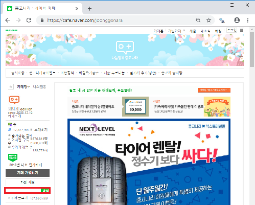

# 코드 작성 과정

### 1. url 찾기
중고나라 첫 화면<br>

빨간색 상자에 '아이패드'를 검색
```r
# 중고나라 첫 화면으로 이동
remDr$navigate("https://cafe.naver.com/joonggonara")
# 빨간색 상자 찾기, id를 이용하여 찾음
queryInput = remDr$findElement(using="id", value="topLayerQueryInput")
# "아이패드"라고 입력하면 '?븘?씠?뙣?뱶'를 검색
# "아이패드"를 utf-8로 변환한 값을 이용하여 검색
queryInput$sendKeysToElement(list("\xEC\x95\x84\xEC\x9D\xB4\xED\x8C\xA8\xEB\x93\x9C", key="enter"))
```
### 2. frame 전환
naver cafe의 경우 iframe을 통해 구현되어 있음

iframe(Inline Frame)

웹 페이지 안에 또 다른 웹 페이지 삽입  
문서내의 원하는 위치에 삽입 가능

Selenium은 최상위의 문서만을 인식할 수 있음. iframe에 있는 element를 이용하려면 창을 변경하는 것과 유사하게 frame을 변경해야 함.
